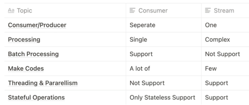
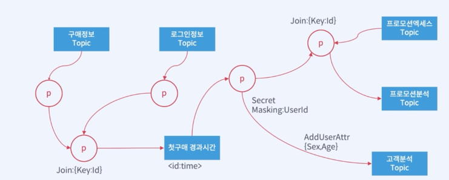

# kafka

```
bin/zkServer.sh start-foreground

bin/kafka-server-start.sh config/server.properties
```


## 1. 토픽명
a. Rule을 정해 패턴화하여 의미를 부여
토픽명은 한번 정하면 바꾸기가 매우 어려움

## 2. 토픽의 파티션 개수 계산
- 1초당 메시지 발행 수 / Consumer Thread 1개가 1초당 처리하는 메시지 수
- 1000 / 100 = 10개의 파티션 필요

파티션 수를 늘릴 수 있지만 줄일 수는 없음

## 3. Retention 시간
디스크 크기와 데이터의 중요성에 따라 판단


컨텍스트 초기화할 때 생성
```java
@Bean
public NewTopic clip2() {
    return TopicBuilder.name("clip2").build();
}

@Bean
public KafkaAdmin.NewTopics clip2s() {
        return new KafkaAdmin.NewTopics(
        TopicBuilder.name("clip2-part1").build(),
        TopicBuilder.name("clip2-part2")
        .partitions(3)
        .replicas(1)
        .config(TopicConfig.RETENTION_MS_CONFIG, String.valueOf(1000 * 60 * 60))
        .build()
    );
}


@Bean
public ApplicationRunner runner(AdminClient adminClient) {
    return args -> {
        Map<String, TopicListing> topics = adminClient.listTopics().namesToListings().get();
    
        for (String topicName : topics.keySet()) {
        TopicListing topicListing = topics.get(topicName);
        System.out.println(topicListing);
    
        Map<String, TopicDescription> description = adminClient.describeTopics(Collections.singleton(topicName)).allTopicNames().get();
    
        System.out.println(description);
    
        adminClient.deleteTopics(Collections.singleton(topicName));
        }
    };
}
```


## 1. kafkaTemplate 설정

a. ProducerFactory 클래스를 이용해 생성
- 트랜잭션을 사용하지 않는 경우, Singleton 으로 생성
- flush()를 사용할 경우 같은 Porudcer를 사용하는 다른 쓰레드에서 지연현상이 발생할 수 있음
    - 2.3 이후부터 producerPerThread속성 추가
    - true로 설정하게 되면, 각 쓰레드에서 별도의 생성자를 만들고 캐시처리
    - 생성자가 더이상 필요하지 않을 경우 closeThreadBoundProducer()를 호출
- 2.5.10 부터는 설정을 업데에트하거나 제거할 수 있는 method를 제공
    - SSL 키 변경등에 유용하게 사용
    - reset()을 사용할 경우, 기존 Producer 는 닫고 새로운 설정으로 Producer 생성
    - Transactional, Non-Transactional 로의 변경은 불가능


### 1. KafkaTemplate 메시지 발송
- 기본적으로 비동기처리
    - 동기로 처리할 수 있으나 카프카의 목적이 빠른 스트림 처리이므로 사용하지 않는게 좋음
- 발송방법
    - Message<?>객체를 이용
        - 메시지에 헤더로 정보를 제공 가능 (TOPIC, PARTITION_ID, MESSAGE_KEY, TIMESTAMP)
    - ProducerRecord<K, V>를 이용
    - 토픽, 파티션, 오프셋 설정 후 전송
### 2. KakfaTemplate Listener
- KafkaSendCallback

### 3. RoutingKafkaTemplate
   전송하는 토픽별로 옵션을 다르게 설정할 수 있음
   transactions, execute, flush, metric 사용할 수 없음

### 4. ReplyingKafkaTemplate
   Consumer 특정 데이터 전발 여부 확인 할 수 있음
   KafkaHeaders. CORRELATION_ID, REPLY_TOPIC, REPLY_PARTITION


Record
MessageListener > Auto commit
AcknowledgingMessageListener > Manual Commit
ConsumerAwareMessageListener > Consumer 객체 활용
AcknowledgingConsumerAwareMessageListener > Manual Commit, 컨슈머 객체를 활용

Batch

Consumer는 Thread-Safe 하지 않으므로 Listener를 호출하는 쓰레드에서만 호출

AckMode
RECORD, BATCH, TIME, COUNT, COUNT_TIME, MANUAL, MANUAL_IMMEDIATE


### Container

1. KafkaMessageListenerContainer -> single thread
2. ConcurrentMessageListenerContainer -> 1개 이상, foreach로 순차적으로 실행
start, stop, pause, resume
3. 풍부한 AckMode를 지원

### @KafkaListener
1. 다양한 설정을 property 로 손쉽게
2. 메타 데이터 
OFFSET, RECEIVED_MESSAGE_KEY, RECEIVED_TOPIC, RECEIVED_PARITION_ID, RECEIVED_TIMESTAMP, TIMESTAMP_TYPE

### payload validator

KafkaListenerEndpointRegistrar
LocalValidatorFactoryBean도 사용가능

### Retrying Deliveries

### Retry Stateful


kafka 정보

```java
@KafkaListener(id = "clip4-listener-id", topics = "clip4-listener")
public void listen(
        String message, 
        @Header(KafkaHeaders.RECEIVED_TIMESTAMP) long timestamp,
        ConsumerRecordMetadata metadata
) {
    System.out.println("listener listen " + message + " metadata : " + metadata.offset());
}
```
 


## Error Handling
- Retry Delivery
  - RetryTemplate, RecoveryCallback
- ErrorHandler
  - DeadLetterPublishingRecoverer (ConsumerAwareRecordRecoverer -> default 재전송함)


## Kafka Streams
a. StreamBuilder
b. Ktable
c. Branch




EDM + Kafka
 
 쇼핑몰
 주문 재고 결제
 
 Inventory topic, payment topic, order topic
 
 
 핸들링하는 데이터 특성에 맞게 db를 세팅
 Polyglot Persistence
 
 EDM -> transactional 처리 고민!!
 
 MSA에 각 서비스는 로컬 트랜잭션만 가능
 SAGA 패턴은 local transaction 완료하면 트리거 될 수 있도록 이벤트를
 이벤트 채널에 퍼블리시한다.
 중간에 실패하면 트랜잭션 실패 이벤트를 publish해서 역순으로 롤백
 
 choreography, orchestration
 
 
 transaction_id order inventory payment로 넘어 다님
 
 
 ORDER_CREATED -> inventory reserved
 ORDER_CANCEL -> inventory rollback


## UseCase에 기반한 kafka 서비스 요구사항 정의

1. 가용성
2. 성능 용량
   - 200 Ops/sec 초당 100개 구매 이력 발생, 200Byte가 60초 200개 발생. 200Byte * 2repl * 1440분 * 5일 * 200개 = 34.5Gb + buffer 5Gb

프로모션 노출 로직 실시간 변경 서비스 - 실시간 프로모션 구매 포션 확인 서비스

- 이력을 넘겨주는 방식 -> API, LogFile, Kafka
- 노출되지 않아야 할 개인 정보
- 저장공간의 문제 발생 시 서비스에서 보장해야 하는 데이터 보관기간
- 실시간 구매로그가 추후 다른 곳에 쓰일 수 있는가?

Topology, Kafka Stream

Kafka에서 Topology란 : 프로세스와 토픽등이 연결된 모습, 메시지의 흐름 + 기본적 처리 내




Zookeeper: cluster 및 하위요소에 대한 전반적인 메타정보, Controller 정보, 선출, Broker 정보
Brokder: 실제 data를 받아 저장하고 있음
Controller: broker 대장

